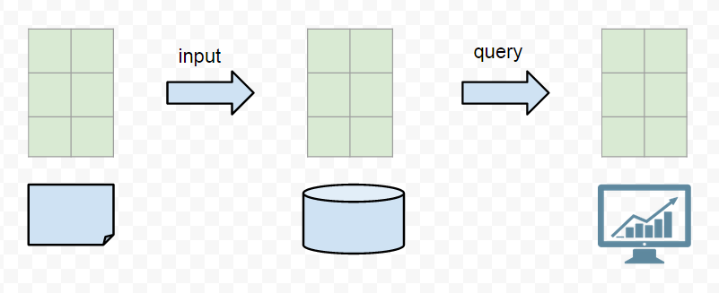
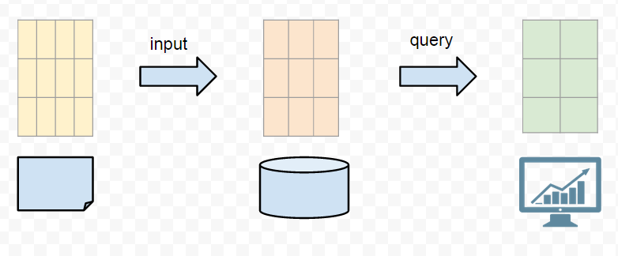

# Agility
What is agility? To understand that, we need to know how traditional TSDB works.

What you report is what gets stored. What you stored, is what you can query. The schema is exactly same from the raw data to the chart on monitor. Also, the shema is limited to two dimension, key being the timestamp, value being a numeric. What if you need to change the chart to view? Well, you have to go back to the source, modify and wait for new data. What if you need to aggregate up the curves? It is either too slow or impossible to so. Normally you will end up with do the aggregation yourself (using tools such as Statsd), then put the aggregated data into the TSDB.

This is a what a agile TSDB looks like:

The input data and stored data can be multi-dimensional. They do not need to be a exact match, some transformation and aggregation can happen at the input phase. One input can be transformed differently, just like materalized view in RDBMS. At the query time, fast aggregation executed on the fly giving us two dimensional data back to render the charts on monitor. This way, if we want to change how the data being viewed to gain different insights from different perspective, we can change the query or input phase, do not need to go all the way back to the origins. Think about re-deploying collection script on thousands of machines, that is not the agile cycle we have in mind.

# Database Selection

Existing solutions available on the market can be roughly divided into 4 categories:

1. Old school: RRD Tool, Graphite
1. Fast K/V: opentsdb, kairosDB, influxdb, blueflood
1. TSDB that can aggregate: citusdb, elasticsearch, druid
1. Future: VectorWise(Actian), Alenka, mapD, blazingdb, gpudb

Old school TSDB are invented by the field ops guy to solve immediate issue, they can not support aggregate on query time, can not hold very long history without loss roll up. They are still valid practical solution to practical problems. But hey, who invents database from filesystem ground up these days?

Fast K/V solution are backed by solid distributed K/V database, instead of relying on the local file system directly. Opentsdb builds on hbase, kairosDB and blueflood build on cassandra. Influxdb is more ambitious, it is built on local leveldb, and do the networking distributed computation part themself. They all are good at keeping long history, some even have built-in materalized view support (fan-out). What is missing is the on the fly aggregation capability. In general, they limit you to store two dimensional data in the database.

TSDB that can actually support aggregation is the key to agility. Cloudflare is using citusdb as their backbone analytics database (https://blog.cloudflare.com/scaling-out-postgresql-for-cloudflare-analytics-using-citusdb/). My choice is elasticsearch. They both share the same architecture, columnar compact on disk storage, fast and distributed aggregation pipeline built as the first class citizen. Unlike relying on external K/V storage, aggregation will encounter data locality issue. There are other guys' who share the same view on this: http://blog.parsely.com/post/1928/cass/ , no suprisingly we all use Elasticsearch https://www.elastic.co/blog/pythonic-analytics-with-elasticsearch

There are the fourth category of database that is the future. Database leveraging SIMD instructions of CPU (from MMX, SSE to AVX), or the many core GPU can aggregate all of the data insanely fast. VectorWise being the pioneer in using SIMD feature and keeping most of the data hot in CPU L2 Cache. There are increasing more and more database popping up on this area, specially to take the advantage of GPU. But, there is no good open source solution ready to production yet.