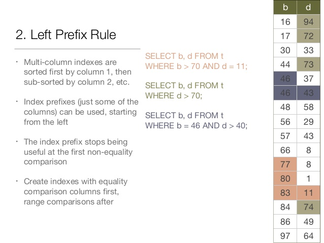

In this chapter, we explore the features provided by Elasticsearch that can be used to build a agile time series database. We can see how good experience from existing solutions can be applied to Elasticsearch, also how to mitigate the problems of existing solutions.

# Architecture

To answer query like

```
SELECT AVG(age) FROM login WHERE timestamp > xxx AND timestamp < yyy AND site = 'zzz'
```

The query need to go through three things (in RDBMS terms):


In Mysql, the three steps are:

1. look up the filters in its b-tree index, and found a list of row ids
2. use the row ids to retrieve rows from the primary row store
3. compute the group by and projections in memory from the loaded rows

Using Elasticsearch as a database is very similar:

1. look up the filters in its inverted index, found a list of document ids
2. use the document ids to retrieve the values of columns mentioned in projections
3. compute the group by and projections in memory from the loaded documents

Conceptually despite Elasticsearch is a full-text index not a relational database, the process are nearly identical. The differences are:

* Elasticsearch is using inverted index instead of b-tree index to process filters
* Mysql row is called document in Elaticsearch
* Mysql has only one way to load the whole row from row store using row ids, Elaticsearch has 4 different ways to load the values using document ids

Elaticsearch is faster and more scalable than mysql for time series data because:

* Inverted index is more efficient to filter out large number of documents than b-tree index
* Elasticsearch has a way to load large number of values using the document ids efficiently, mysql does not which makes its b-tree index useless in this context
* Elasticsearch has a fast and sharded in memory computation layer to scale out, and there are optimization to bring in SIMD to optimize the speed further

Let's go through them one by one, I am sure you will love Elasticsearch.

# Inverted Index

There is one article that explains inverted index very well: http://blog.parsely.com/post/1691/lucene/

The example from the article illustrated what is inverted index very well:

```
doc1={"tag": "big data"}
doc2={"tag": "big data"}
doc3={"tag": "small data"}
```

The inverted index for the documents looks like:

```
big=[doc1,doc2]
data=[doc1,doc2,doc3]
small=[doc3]
```
b-tree index is not that different from end-user perspective, b-tree also invert the rowid=>value to value=>rowid, so that find rows contains certain value can be very fast.

But in mysql, if you have two columns and you have query like "plat='wx' AND os='android'" then using b-tree index to index plat and os is not enough. In the runtime, if you have index for column plat and another index for column os, mysql have to pick one of most selective index to use, leave another index not used at all. There is a great presentation on how index work in mysql: http://www.slideshare.net/vividcortex/optimizing-mysql-queries-with-indexes



To index both column plat and os, then you have to create a multi column index to include both and even the ordering of the columns matters, index for plat,os and os,plat are different.

In elasticsearch, the inverted index are composable. You only need to index os, and plat separately. In the runtime, the both index can be used and combined to speed up the query. The filter plat='wx, os='android' can event be cached separately to speed up future querys.

The trick is called "roaring bitmap" (http://roaringbitmap.org/). Druid database has a detailed on article on how the magic works: http://druid.io/blog/2012/09/21/druid-bitmap-compression.html

There are two challenges to use bitset on the filter result. If we have 1 million documents, then for a given filter(for example plat='wx') there will be 1 million 1/0 result. How to represent the 1 million boolean result with minimum size is not a easy job.

This is a active research area to compress the sparse bitset. The filter result is sometime very sparse. For example user="wentao" will likely only have 1 hit out of 1 million documents. Storing nearly 1 million zeros will be such a waste. So the simplest compression is to represent a series of 1 or 0 using a compact form.

for example: ```11111111 10001000 11110001 11100010 11111111 11111111```

the last two words are all 1, so it can be compressed to

```
header section:   00001
content section:  11111111 10001000 11110001 11100010 10000010
```

Another challenge is to do AND/OR/NOT calculation for the compressed bitset. If we have to uncompress to do boolean logic operation, then the compression is not very helpful to save memory. Algorithms are invented to do the AND/OR/NOT on the compressed data.

The actual compression algorithm used in Elasticsearch (lucene is the underlying storage) is very complex and efficient. http://svn.apache.org/repos/asf/lucene/dev/trunk/lucene/core/src/java/org/apache/lucene/util/SparseFixedBitSet.java

The biggest benefit Elasticsearch can give us is to index a lot of columns separately. When doing the query, filters on different columns can be evaluated to bitset and cached efficiently. Then the filter result is AND/OR/NOT of the those individual bitset. There is no composite index in Elasticsearch, unlike mysql.

# DocValues

In mysql, having a bunch of row ids filtered from the b-tree index, then load from the row store are very time consuming "random access" process. Similarly, having a bunch of document ids filtered from the inverted index, how to load other fields of those documents efficiently?

There are 4 ways to load document values that in Elasticsearch, take field "user_age" as example:

* Using _source "stored field", the document is stored as json, need to parse and get the field "user_age"
* Using user_age "stored field" if it is stored
* If user_age is indexed in inverted index, Elasticsearch will un-invert the index to form a document_id=>user_age mapping in memory (called "field cache"), then load from the "field cache"
* If user_age is docvalues, then the field can be loaded from docvalues file


