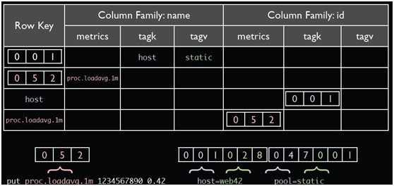
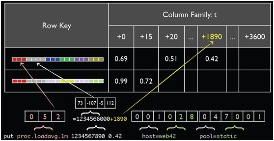
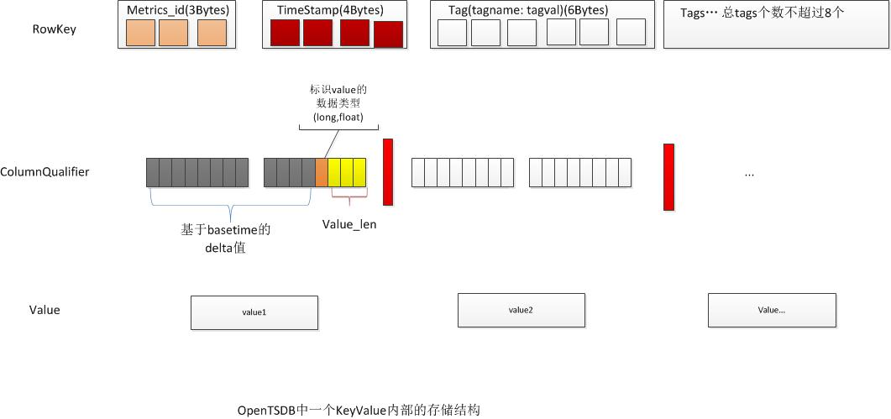
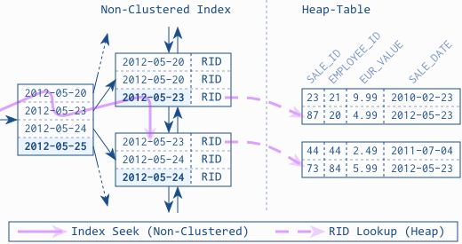
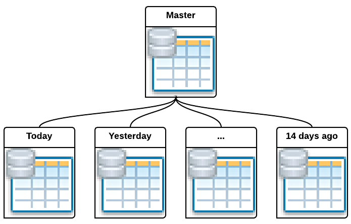
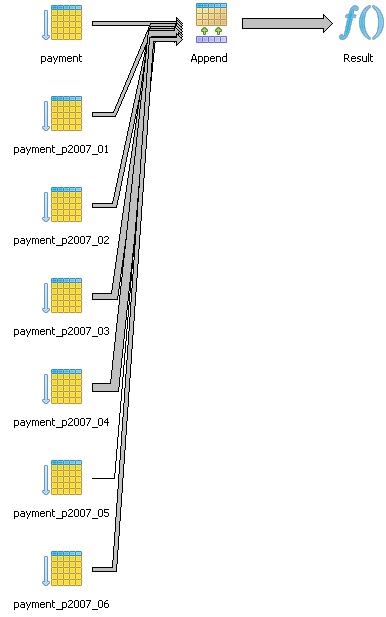
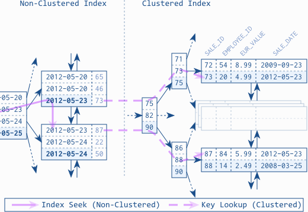
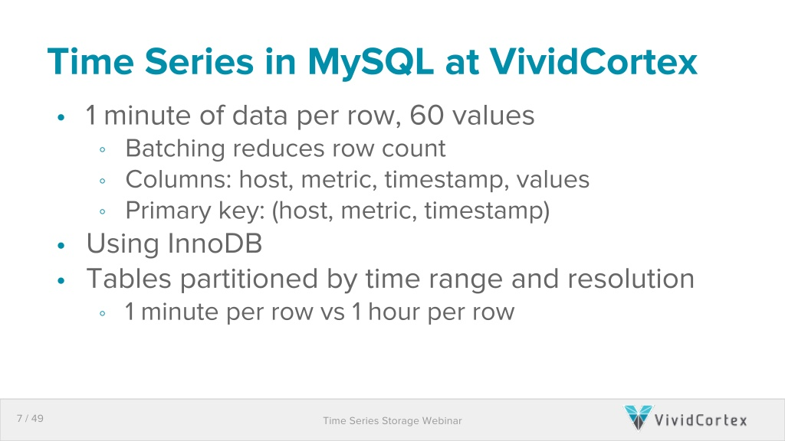
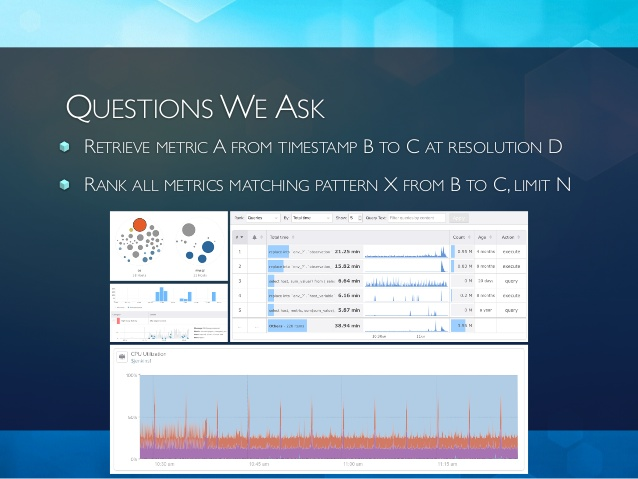
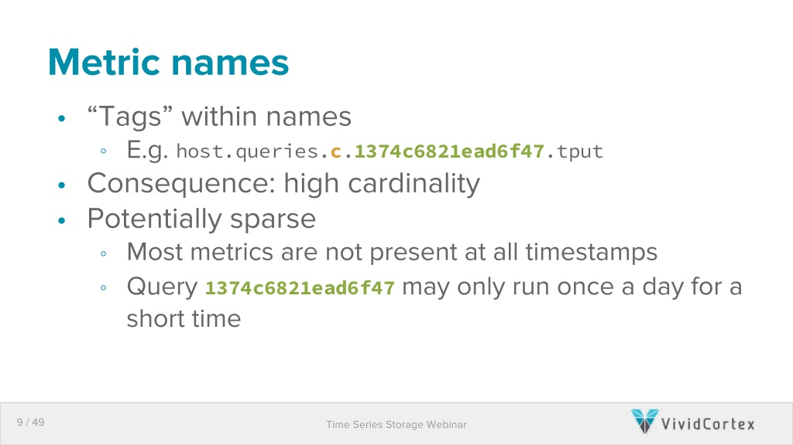

There are a lot of existing solutions. They all have some good internal design that makes them particularly good at some aspect, by pushing the underlying storage to its limit. Learning from the good old experience is a necessary to build a better one. The following databases all share the same record data mode:

```
[metric_name],[timestamp],[value]
```

All of them can handle this kind of data very well, and can return the records within a time range very fast.

# Opentsdb

Opentsdb is a good presentive of fast k/v based solution. It makes very good use of underlying HBase features to maximize the performance and minimized the cost to store large volume of data.

## TSUID

http://opentsdb.net/docs/build/html/user_guide/uids.html

Opentsdb support metric name, tags. But metric name and tags are not stored in each data point to save space. Instead, each metric name + tags combination will be assigned with a TSUID (time series unique id), then each data point only need to store TSUID with it. When querying the data, first translate the metric name and tags to TSUID, then load the data points using TSUID.



This is the bi-directional mapping table for TSUID and raw metric name + tags



Metric name + tags will be combined to a long TSUID. take the above example

```
proc.loadavg.1m host=web42 pool=static
metric_name tagk=tagv tagk=tagv ....
052 001 028 047 001
052001028047001 is the final TSUID used
```

By default, UIDs are encoded on 3 bytes in storage, giving a maximum unique ID of 16,777,215 for each UID type. Given tag value is also encoded as TSUID, when the tag value contains something like QQ number, very quickly we can run out of 16 million limit. To change the 3 bytes limit to 4 bytes or more, requires recompile Opentsdb itself, and existing data will not be compatible.

Scanning all data with same metric name but different tags is possible. TSUID is part of the hbase row key, so scan the sequential rows can load metric at one timestamp of all tags. Take the above example, search rows start with 052 can give us all data of metric "proc.loadavg.1m"

The key idea is using table lookup (or dictionary encoding) to compress low cardinal repeated values (the dimensions of time series data). It is a common technique to compress string data in analytical database. Opentsdb TSUID is just a sepcial purpose implementation.

## HBase Scan

HBase can scan a large number of records in very short time. The scan limited to scan along the sort order defined by row key. Defining the right row key to support the query, so that scan can be most optimal is the key to fast HBase usage. Essentially, Rowkey in HBase is the index in database terms, and the only index. Not only for fast single record retrival, but also for large range scan.

This is the rowkey for opentsdb



Rowkey is in the format: metric_name+timestamp then 8 optional tagk,tagv pair

So query "proc.loadavg.1m" between 12:05 and 13:00 is a very fast range scan to batch load all the data. As the data is first sorted by metric name and then sorted by timestamp. Data of other metric will not affect the query performance. Data at yesterday will not affect the query performance.

But if the query is about "proc.loadavg.1m{host=web1}" then we have to scan all "proc.loadavg.1m" within the time range, then filter out host=web1 in memory. If there are 1 million hosts per minute, then we need to load 1 millions records for 1 minute, but only keep 1 record, which is very slow. So a common techique is to encode the tagk/tagv in the metric itself. Then we will have metric like "proc.loadavg.1m.host.web1".

## Compact

The idea of compact to store 1 minute even 1 hour data per row, instead of 1 second data per row. So we can reduce the number of rows to speed up the query performance. But to keep the insert fast, we are not going to rewrite the row for every insert, instead the insert will be 1 second level, then periodically the 1 second data will be "compacted" to 1 minute or 1 hour.


The cost of row is too heavy (for example, the dimensions need to stored again and again), it is better to pay the cost once and get as many as possible out of a single row. Note, even the per column cost is too high, opentsdb is not leveraging the multi-column feature, instead everything is packed into the same column.

# PostgreSQL

PostgresSQL is a very standard RDBMS. A lot of people are using it to store time series data.

## B-tree index is useless for time series

RDBMS is primary a heap like row store. You can load one row using its row id (primay key) from the row store very fast. However if the query do not use the primary key, the database will scan the whole table to find the rows we want. To avoid full table scan, a b-tree based seconary index is introduced to allow looking up the index to find out what rows are required. The process can be illustrated as:



b-tree index is looked up to find the row id, then the row id is used to load from the row store to get actual data. Using the row id to load data is "random access" of the on disk data. B-tree index is optimized to load small number of rows, so that "random access" penality is negligible compared to the benefit of filtering out the exact rows needed by b-tree index. However, this optimization does not work for time series data. After filtering by b-tree index, there are many  thousands of rows need to be fetched from the row store, then the "random access" cost will be very high. A lot of times, database query planner will decide to fallback to full table scan instead of using the index in this scenario.

## Partition as coarse grained timestamp based index

Another commonly used technique is partitioning. The simplest way is just to create a new table to store data for every day.



When query a partitioned table, the query planner can know the time range filter will cover how many partitions. Then when doing full table scan the filter out the rows, only the partitions actually covered by the filters will be touched. Then the result for each partition is collected then merged. This is a query plan generated by PostgreSQL:



Essentially, table partitioned by the timestamp is using the timestamp as a coarse grained index. It is very useful to maintain a constant speed for time series data query, even the historic data keeps growing.

# Mongodb

There are also a lot of people trying to fit their hammers into any kind of holes, mongodb is no exception. Mongodb is architecturally very similar to tranditional RDBMS, but the table per day partitioning optimization does not apply to Mongodb, as mongodb has no native partitioning support, other than you roll your own at the application level.

But Mongodb has two great feature:

* the data model is very flexible. One document can hold many sub documents
* if no size increase, document can be updated inplace very fast

Leveraging these two features of the database engine, one can design the schema like this

```
{
  timestamp_minute: ISODate("2013-10-10T23:06:00.000Z"),
  type: “memory_used”,
  values: {
    0: 999999,
    …  
    37: 1000000,
    38: 1500000,
    … 
    59: 2000000
  }
}
```
The idea is for every new data point, we update the document for the minute, instead of inserting a new document until the next minute. Same can be applied for one hour or one day. This way, when querying the data for the minute/hour/day, we just need to load one big document which is fast.

# VividCortext

VividCortext is a mysql performance monitoring company lead by mysql performance expert Baron Schwartz. You can bet he knows how to use mysql well. Not surprisingly, everyone just fits their hammers into any holes, VividCortex is using mysql to store time series data for their monitoring business.

Baron Schewartz is kind enough to share their secret on how to push mysql to its limit as fast TSDB:

* video: https://www.youtube.com/watch?v=ldyKJL_IVl8
* slides: http://www.slideshare.net/vividcortex/vividcortex-building-a-timeseries-database-in-mysql
* video (improved): https://www.youtube.com/watch?v=kTD1NuQXr4k&t=5h49m27s
* slides (improved): http://www.slideshare.net/vividcortex/scaling-vividortexs-big-data-systems-on-mysql
* another related slides: http://www.slideshare.net/vividcortex/catena-a-highperformance-time-series-data

## Clustered Index

Mysql Innodb storage engine has a feature called "clustered index". Normally the primary key of the table is the clustered index. The clustered index key or primary key is stored physcially on disk in sorted order. So that scan a sequence of primary key is very fast, just like hbase where rows are sorted by row key.



Using clustered index the row store of mysql is also a b-tree index. For in-depth details on how clustered index works: https://www.simple-talk.com/sql/learn-sql-server/effective-clustered-indexes/



The primary key they use is "host.metric,timestamp", so that accessing a range of data points for a host/metric combination is optimized. The primary key design is exactly the same as opentsdb hbase row key design.

## Sparse Metric

A common problem when using metric name to represent every dimension is there will be a lot of metrics. Some user of graphite or opentsdb used Elasticsearch to build a database of metric name to allow search. VividCortex has similar problem. They collect metric or every database queries. So metric for a specific type of queries might not present in certain time ranges. If they need to answer this:



```Rank all metrics matching pattern X from B to C, limit N```

With the primary key design mentioned above, there is no easy way to figure out what are the metrics present in time range B to C? 



This problem is sovled by building a secondary index for metric name using external redis database. They ned to first query redis to see how many metrics present in [B, C] time range, then use the metric name to query mysql for the actual data. Just like other people using Elasticsearch for similar purpose, which is UGLY...

## Compact

Just like everybody else (opentsdb, mongodb), compact many data points into a single row is a great way to boost performance. VividCortex compact many data points in a single row, at cost of losing the ability to query using raw SQL. Developers at vividcortex have to internal service to query the TSDB, as the service code understands how the compaction works. Without compaction, there will be too many rows to be stored and queried efficiently in mysql.

# Summary

Traditional RDBMS and Fast K/V database can make great TSDB. If we can know all the query we will make, and with clever design, everything can fit into the metric name centric data model. But in case you are wondering how to query a large number of metrics in one time and select the top N or aggregate them up, you would better to review if you can choose a better metric name design.
If you can not know the querys ahead of time, or there is no good way to normalize or denormalize so that metric name centric model can fit, then let's explore other options.