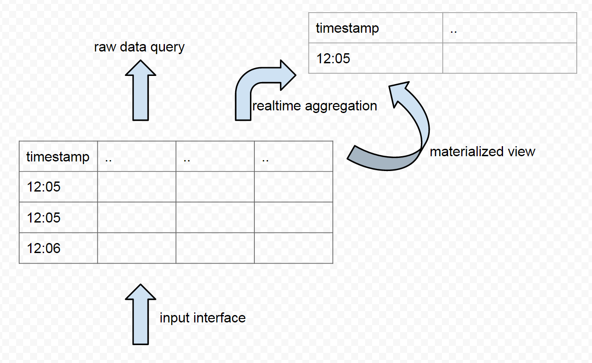

# Record Data Model

Before we dive in, it is better to clarify what is time series. Examples of time series data could be stock price in stock market, temperature of the weather, CPU usage of a host. It is obvious time series data should contain a field called timestamp. I would argue potentially everything can have a timestamp with it. Time series is not just about the extra timestamp field of the data, but more about how to query it. When we think something is a time series, the query we use always include a time range. The result of the query always contain a timestamp field. A complete data model for a time series should be:

```
[timestamp],[d1],[d2]...[dn],[v1],[v2]...[vn]
# d1 ~ dn are dimensions, like ip, idc, country
# v1 ~ vn are values, like cpu_usage, free_memory_bytes
```
Values should always be numeric, host name should never be a value. Values can be optional, it is totally valid to have a record of time series without values. For example, we can have a record to about some user logined the website at some specific time. The record has no value associated with it, but have a series of records we know tell how many people logined during last minute.

Dimensions are most categorical, such as the type of user, yoru user name. However, some numeric field can be viewed as dimension as well, such as the age of a user. There is no clear distinction betwen what is a dimension, what is value. In a lot of context, the comination of diemnsions makes it unique for that timestamp. For example, for a given cpu at given time, there is only one cpu usage value.

It worth mentioning in the context of a lot of time series database, the data model is in a limited form

```
[metric_name],[timestamp],[value]
# metric_name is a string such as sys.loadavg.1m
# value is a numeric
```
It is very common to encode a lot of dimensions into the metric name if the database forces us to do so.

# Characteristics

Time series database is called TSDB, and separated from normal database for very good reason.It is a special kind of database to support operational intelligence, Internet of Things (IoT). The kind of data can be characterized as:

* extreme high volume/velocity: at the magnitude of 1 billion per day
* low latency: operational intelligence requires very fast query time, unlike tranditional BI, report generation can tolerate hours of time
* low value: the data should be stored and queried very cheaply, most of the machine generated operational intelligence data is not very interesting

Store and query large volume of low value data cheaply presents very unique technique challenges. Most of the challenges are unmet by existing solutions, and we are seeing a lot of novel solutions popping up recently.

# Functionality

Functional wise, TSDB is not that much different from a traditional relational data management system (RDBMS). We can build a TSDB upon traditional RDBMS like mysql or postgresql. For mysql database, within 1 million rows, it can be queries within second, and hold the volume of data wihout a problem. What mordern TDSB can provide us is nearly the same capability (except sub query or join) provided by mysql, but with a 100x ~ 1000x size of data per day (100 million to 1 billion rows), and maintain linear scalability for infinite number of days of data given enough machines provided. 



The functionality of a TSDB can be listed as 4 types:

* input interface: like INSERT INTO sql
* raw data query: like SELECT xxx FROM xxx WHERE
* realtime aggregation: like SELECT xxx FROM xxx GROUP BY xxx
* materialized view: like INSERT INTO xxx SELECT xxx, or CREATE VIEW xxx

Materialized view is to transform the shape of one table into another form, so that slow query can be faster (because less rows), or impossible query can be possible (like ip translated to province, then we can group by province). Materialized view was implemented in RDBMS as view (by CREATE VIEW statement), and the data can be auto-refreshed in the background (https://en.wikipedia.org/wiki/Materialized_view). 

The primary missing features in TSDB are:

* no sub query: the realtime aggregation is very limited for performance reason. Sub query (SELECT xxx FROM (SELECT xxx FROM some_table)) is not a common feature in TSDB.
* no join: join at query time is considered slow, so TSDB do not allow join in query time. One work around is to join at the input time (like in TRT-Storm phase).
* no post aggregation:  one common SQL feature not supported by TSDB is HAVING statement. HAVING will do the filtering after aggregation

